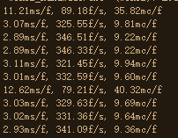
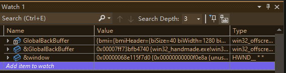
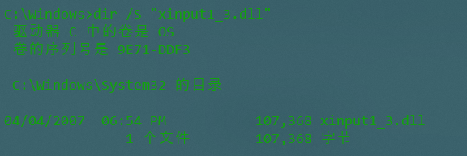
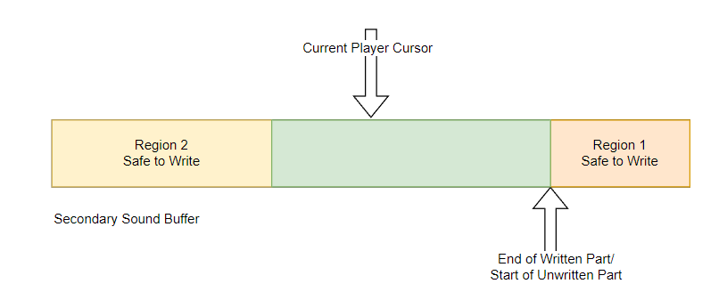

## TODO-List

​	Comment style: **TODO🚨** 

1. Explain params of `WinMain`.
2. Change the functions parts from `xxx()` to `xxx` function.
3. What is a generated instruction?
4. Platform independent API?
5. Characters... come on...
6. 

## Chap#000 Misc: Interesting Topics

#### Section#01 Windows Data Types for String

- Doc: https://learn.microsoft.com/en-us/windows/win32/intl/windows-data-types-for-strings

**3 sets of character**

1. Generic Type
2. Unicode: 16-bit
3. Windows code pages, ASCII strings?: 8bit

**Difference between Windows Code Pages and Unicode**

- The basic unit of operation is a 16-bit character for Unicode and an 8-bit character for Windows code pages.

#### Section#02 Conventions for Function Prototypes

- Doc: https://learn.microsoft.com/en-us/windows/win32/intl/conventions-for-function-prototypes

> New Windows applications should use Unicode to avoid the inconsistencies of varied code pages and for ease of localization. They should be written with generic functions, and should define UNICODE to compile the functions into Unicode functions. In the few places where an application must work with 8-bit character data, it can make explicit use of the functions for Windows code pages.

```c++
#ifdef UNICODE
#define SetWindowText SetWindowTextW
#else
#define SetWindowText SetWindowTextA
#endif

BOOL SetWindowTextA(
  HWND hwnd,
  LPCSTR lpText
);

BOOL SetWindowTextW(
  HWND hwnd,
  LPCWSTR lpText
);
```

- Windows code page prototype uses the type LPCSTR.
- Unicode prototype uses LPCWSTR.

#### Section#03 Query Performance

*LARGE_INTEGER* Struct

- Syntax: https://learn.microsoft.com/en-us/windows/win32/api/winnt/ns-winnt-large_integer-r1

  ```c++
  typedef union _LARGE_INTEGER {
    struct {
      DWORD LowPart;
      LONG  HighPart;
    } DUMMYSTRUCTNAME;
    struct {
      DWORD LowPart;
      LONG  HighPart;
    } u;
    LONGLONG QuadPart;
  } LARGE_INTEGER;
  ```

- Remarks

  >If your compiler has built-in support for 64-bit integers, use the `QuadPart` member to store the 64-bit integer. Otherwise, use the `LowPart` and `HighPart` members to store the 64-bit integer.

`QueryPerformanceFrequency` function

- Syntax: https://learn.microsoft.com/en-us/windows/win32/api/profileapi/nf-profileapi-queryperformancefrequency

- Retrieves the frequency of the performance counter.

- Remarks:

  - Fixed
  - Need only be queried upon application initialization
  - Cache the result

- Use case

  ```
  LARGE_INTEGER perfFrequencyResult;
  QueryPerformanceFrequency(&perfFrequencyResult);
  GlobalPerfFrequency = perfFrequencyResult.QuadPart;
  ```

`QueryPerformanceCounter` function

- Syntax: https://learn.microsoft.com/en-us/windows/win32/api/profileapi/nf-profileapi-queryperformancecounter
- Retrieves the current value of the performance counter.

`__rdtsc ` function

- Syntax: https://learn.microsoft.com/en-us/cpp/intrinsics/rdtsc?view=msvc-170
- **TODO🚨** Generates the `rdtsc` instruction, which returns the processor time stamp. The processor <u>time stamp</u> records the number of <u>clock cycles</u> since the last reset.

Query FPS, MSPF and MCPF

```c++
// Retrieves performance frequency.
LARGE_INTEGER perf_frequency_res;
QueryPerformanceFrequency(&perf_frequency_res);
Global_Perf_Frequency = perf_frequency_res.QuadPart;

// @note Debug stuff, query last clock-cycle count;
LARGE_INTEGER last_counter;
QueryPerformanceCounter(&last_counter);
UINT64 last_cycle_count = __rdtsc();


while (running) {
    // Rendering Stuff
    // Audio Stuff
    // Handle User Input
    // ...
    
   { // Display debug data
      /* @note query performance data. */
      LARGE_INTEGER end_counter;
      QueryPerformanceCounter(&end_counter);
      INT64 counter_elapsed = end_counter.QuadPart - last_counter.QuadPart;
      UINT64 end_cycle_count = __rdtsc();
      UINT64 cycles_elapsed = end_cycle_count - last_cycle_count;

      // Milliseconds per frame
      float mspf =
        (1000.0f * (float)counter_elapsed) / (float)Global_Perf_Frequency;
      // Frames per second
      float fps = (float)Global_Perf_Frequency / (float)counter_elapsed;
      // Mega-Cycles per frame
      float mcpf = (float)cycles_elapsed / (1000.0f * 1000.0f);

      // char perf_log[256];
      // sprintf(perf_log, "%.2fms/f, %.2ff/s, %.2fmc/f\n", mspf, fps, mcpf);
      // Win32_Debug_Log(perf_log);

      // Update performance data of current frame.
      last_counter = end_counter;
      last_cycle_count = end_cycle_count;
    }
}
```

Result



- Verification

  - CPU Specification: 
    - Base Clock: 3.2GHz
  - $325.55 \times 9.81 \times (1,000,000) = 3,193,645,500\approx 3.2 \times (1,000,000,000)$

#### Section#04 Assert

```
#define asser(expr) if (!(expr)) {*(int *) 0 = 0;}
```

#### Section#05 Built-in Types

**Data Type Ranges**

https://learn.microsoft.com/en-us/cpp/cpp/data-type-ranges?view=msvc-170

**Type synonyms**

https://learn.microsoft.com/en-us/cpp/cpp/fundamental-types-cpp?view=msvc-170

| Type             | Other                                                        |
| ---------------- | ------------------------------------------------------------ |
| signed __int8    | char                                                         |
| unsigned __int8  | unsigned char, bool                                          |
| signed __int16   | short, short int, signed short, singed short int             |
| unsigned __int16 | unsigned short, unsigned short int                           |
| signed __int32   | int, singed, singed int \| long, long int, singed long int   |
| unsigned int32   | unsigned , unsigned int \| unsigned long, unsigned long int  |
| unsigned __int64 | unsigned long long int, unsigned long long                   |
| singed __int64   | long long, long long int, signed long long int, signed long long |

**Size of built-in types** 

| Size   | TYPE                                      |
| ------ | ----------------------------------------- |
| 1 Byte | bool, char, unsigned char, signed char    |
| 2 Byte | char16_t, __int16, short, unsigned_short  |
| 4 Byte | char32_t, float, int, long, unsigned long |
| 8 Byte | double, __int64, long double, long long   |

#### Section#06 Controller Dead Zone

- https://learn.microsoft.com/en-us/windows/win32/xinput/getting-started-with-xinput#dead-zone


## Chap#001 Setting up the Windows build

#### Section#1 The entry point -- `WinMain`

```c++
int CALLBACK
WinMain(HINSTANCE instance,
        HINSTANCE prev_instance,
        LPSTR cmd_line,
        int show_cmd)
{
    return 0;
}
```

- Syntax: https://learn.microsoft.com/en-us/windows/win32/api/winbase/nf-winbase-winmain?source=recommendations
- User-provided entry point for a graphical Windows-based application.
- Remarks: your `WinMain` should...
  1. Initialize the application.
  2. Display its main window.
  3. Enter a message retrieval-and-dispatch loop.
- **TODO🚨** Params?
- what is CALLBACK?:
  - https://stackoverflow.com/questions/13871617/winmain-and-main-in-c-extended

#### Section#2 Build tool

**Compiler Command-Line**

Syntax: https://learn.microsoft.com/en-us/cpp/build/reference/compiler-command-line-syntax?view=msvc-170

`cl` is not recognized: https://stackoverflow.com/questions/8800361/cl-is-not-recognized-as-an-internal-or-external-command

Options: https://www.geoffchappell.com/studies/msvc/cl/cl/options.htm

- `/W`: Set warning level
  - `/wd[number]`: Disable a warning
  - `/WX`: Treat warning as errors
- `/FC`: Use full pathnames in diagnostics
- `/Zi`: Enable debugging information
- `/Oi`: Enable intrinsic functions
  - Intrinsic function: https://en.wikipedia.org/wiki/Intrinsic_function
- `/GR`: Directs compiler to emit Run-Time Type info
  - `/GR-`: Directs it not to.
  - RTTI, Run-time type information:  allows the type of an object to be determined during program execution
    - https://learn.microsoft.com/en-us/cpp/cpp/run-time-type-information?view=msvc-170
- `/EHa`
  - Catches both structured (asynchronous) and standard C++ (synchronous) exceptions
  - Stack unwinding: https://stackoverflow.com/questions/2331316/what-is-stack-unwinding
- `/MT`: Causes the application to use the multithread
- `/Fm[dir]`:  Creates a mapfile
  - Mapfile: 
- `/link`: Passes the specified option to LINK
  - `opt:ref`

**build.bat**

```
@echo off
pushd build
cl [Options] FileDir [libs]
popd
```

batch file: https://en.wikipedia.org/wiki/Batch_file

>  It consists of a series of commands to be executed by the Command-Line-Interpreter stored in a plain-text file.

#### Section#3 Debugger: Visual Studio

- Command: `devenv build\win32_handmade.exe`

- A dummy solution would be created for this project.

- Change the working dir:  `[YOUR WORKING DIR]\handmade\data`

- **<u>*Add Watch</u>**

  - 

    Pay attention to the address value of the local variable(window) and the static variable.


#### [MessageBox: A Dummy Hello World Test]

- Syntax: https://learn.microsoft.com/en-us/windows/win32/api/winuser/nf-winuser-messagebox

- Requirements

    | Library    | DLL        |
    | ---------- | ---------- |
    | User32.lib | User32.dll |

- Use case

  ```c++
  MessageBox(
      0,
      Welcome!",
      "Handmade",
      MB_OK|MB_ICONINFORMATION
  );
  ```

## Chap#002 Opening a Win32 Window

#### Section#1 WNDCLASS structure

- Syntax: https://learn.microsoft.com/en-us/windows/win32/api/winuser/ns-winuser-wndclassa
  
- Use case:

  - ```c++
    WNDCLASS window_class = {};
    window_class.style =
        CS_HREDRAW | CS_VREDRAW; // Redraw when adjust or move happend vertically or
    // horizontally.
    window_class.lpfnWndProc = Win32_Main_Window_Callback;
    window_class.hInstance = instance;
    window_class.lpszClassName = "Handmade_Window_Class";
    ```
  
- Windows class style

  - https://learn.microsoft.com/en-us/windows/win32/winmsg/window-class-styles
  
    | CS_HREDRAW                                        | CS_VREDRAW                                      |
    | ------------------------------------------------- | ----------------------------------------------- |
    | Repaint when width changed or horizontally moved. | Repaint when height change or vertically moved. |
  
- *Windows proc callback

  - https://learn.microsoft.com/en-us/windows/win32/api/winuser/nc-winuser-wndproc

    ```c++
    LRESULT CALLBACK
    Win32_Main_Window_Callback(HWND window,
                               UINT message,
                               WPARAM w_param,
                               LPARAM l_param)
    {
      LRESULT result = 0;
      switch (message) {
        case WM_ACTIVATEAPP: {
          Win32_Debug_Log("Activated.");
        } break;
      }
      return result;
    }
    ```
    
  - Message categories
  
    - https://learn.microsoft.com/en-us/windows/win32/winmsg/about-messages-and-message-queues#system-defined-messages
    - Mostly used: WM - General window messages

#### Section#2 Register Window Class

- Syntax:

  - https://learn.microsoft.com/en-us/windows/win32/api/winuser/nf-winuser-registerclassa

  - Return Value: ATOM

    Class atom that uniquely identifies the class. If the function fails, the return value is zero.
    
    - Look for all windows data types: https://learn.microsoft.com/en-us/windows/win32/winprog/windows-data-types

- Use case:

  - ```c++
    if (RegisterClass(&WindowClass)) {
    	// Rendering
    }
    else {
    	// Loging
    }
    ```

#### Section#3 Create Window

- Ex for Extended.

- Syntax: 

  - https://learn.microsoft.com/en-us/windows/win32/api/winuser/nf-winuser-createwindowexa

- Use case:

  - ```c++
    HWND window = CreateWindowEx(0,
                                 window_class.lpszClassName,
                                 "Handmade",
                                 WS_OVERLAPPEDWINDOW | WS_VISIBLE,
                                 CW_USEDEFAULT,
                                 CW_USEDEFAULT,
                                 CW_USEDEFAULT,
                                 CW_USEDEFAULT,
                                 0,
                                 0,
                                 instance,
                                 0);
    assert(window);
    ```

#### Section#4 *Handle Messages

```c++
while (Global_Running) {
    MSG message = {};
    // @note Peek the newest message from queue without pending the application
    while (PeekMessageA(&message, 0, 0, 0, PM_REMOVE)) {
      if (message.message == WM_QUIT)
        Global_Running = false;

      TranslateMessage(&message);
      DispatchMessage(&message);
    }
}
```

`GetMessageA()`

- Syntax: https://learn.microsoft.com/en-us/windows/win32/api/winuser/nf-winuser-getmessage
- Retrieves a message from the calling thread's message queue.
- *Remarks: during this call, the system delivers pending.

`PeekMessageA()`

- Syntax: https://learn.microsoft.com/en-us/windows/win32/api/winuser/nf-winuser-peekmessagea

- Remarks:

  `wRemoveMsg`: Specifies how messages are to be handled.

`TranslateMessage()`:

- Syntax: https://learn.microsoft.com/en-us/windows/win32/api/winuser/nf-winuser-translatemessage?source=recommendations
- Translates virtual-key messages into character messages.

`DispatchMessage()`:

- Syntax: https://learn.microsoft.com/en-us/windows/win32/api/winuser/nf-winuser-dispatchmessage
- Dispatches a message to a window procedure.

#### Section#5 Simple Painting

Use case: inside the `Win32MainWindowCallback`

```c++
case WM_PAINT: {
    PAINTSTRUCT paint;
    HDC deviceContext = BeginPaint(window, &paint);
    int x = paint.rcPaint.left, y = paint.rcPaint.top;
    int width = paint.rcPaint.right - paint.rcPaint.left;
    int height = paint.rcPaint.bottom - paint.rcPaint.top;
    static DWORD backdrop = WHITENESS;
    PatBlt(deviceContext, x, y, width, height, backdrop);
    if (backdrop == WHITENESS) {
        backdrop = BLACKNESS;
    }
    else {
        backdrop = WHITENESS;
    }
    EndPaint(window, &paint);
} break;
```

PAINTSTRUCT

- Syntax: https://learn.microsoft.com/en-us/windows/win32/api/winuser/ns-winuser-paintstruct
- Used to paint the client area of a window owned by that application.

`BeginPaint()`

- Syntax: https://learn.microsoft.com/en-us/windows/win32/api/winuser/nf-winuser-beginpaint
- Prepares the specified window for painting and fills a PAINTSTRUCT structure with information about the painting.

`EndPaint()`

- Syntax: https://learn.microsoft.com/en-us/windows/win32/api/winuser/nf-winuser-endpaint
- Marks the end of painting in the specified window.

`PatBlt()`:

- Syntax: https://learn.microsoft.com/en-us/windows/win32/api/wingdi/nf-wingdi-patblt
- Paints the specified rectangle using the brush that is currently selected into the specified device context.

#### Section#6 Quit

> Let Windows clean up everything for us.

Solution#1 `PostQuitMessage(nExitCode)`

- https://learn.microsoft.com/en-us/windows/win32/api/winuser/nf-winuser-postquitmessage

- exit codes is no concern

*Solution#2 with a global variable - `global bool Global_Running;`

>  use these to separate 3 kinds of "static":
>
>  #define local_persist       static
>  #define global_variable  static
>  #define internal       	   static

- inside the `Win32_Main_Window_Callback` function

  ```c++
  case WM_DESTROY: {
      Global_Running = false;
      OutputDebugStringA("WM_DESTROY\n");
  } break;
  
  case WM_CLOSE: {
      Global_Running = false;
      OutputDebugStringA("WM_CLOSE\n");
  } break;
  ```
  
- inside the entry point, the `WinMain`

  - from: `for(;;)`
  - to: `while(Global_Running)`

## Chap#003 Backbuffer: Allocating and Animating

#### Section#1 the Global backbuffer

 ```c++
 struct win32_back_buffer
 {
   BITMAPINFO bmi;
   void* bitmap;
   int width;
   int height;
   int bytes_per_pixel;
   int pitch;
 };
 
 static win32_back_buffer Global_Back_Buffer;
 ```

#### Section#2 Windows GDI

Windows Graphics Device Interface

- Info: https://learn.microsoft.com/en-us/windows/win32/gdi/windows-gdi
- Enables applications to use graphics and formatted text on video display.
- Do not access the graphics hardware directly, interacts with device drivers.
- Message-Driven Architecture.

Device Context

- Main Purpose: Device Independence

  An application must inform GDI to load a particular device driver, once the driver is loaded, to prepare the device for drawing operations, the creating and maintaining of a DC is needed.

- Defines <u>a set of graphic objects</u> and their associated attributes, and the graphic modes that affect output.

  - **<u>Graphic Objects</u>**

    | gRAPHIC oBJECTS | aSSOCIATED attriBUTES                   |
    | --------------- | --------------------------------------- |
    | Bitmap          | size, bytes, dimensions, pixels...      |
    | Brush           | style, color...                         |
    | Palette         | colors and size (or number of colors).  |
    | Font            | width, height, weight, character set... |
    | Path            | shape                                   |
    | Pen             | style, width, color                     |
    | Region          | location, demensions                    |

#### Section#3 BITMAP structures

​	https://learn.microsoft.com/en-us/windows/win32/gdi/bitmap-structures

BITMAP

- Syntax: https://learn.microsoft.com/en-us/windows/win32/api/wingdi/ns-wingdi-bitmap
- A *bitmap* is a graphical object used to create, manipulate and store images **<u>as files on a disk.</u>**

BITMAPINFO

- Syntax: https://learn.microsoft.com/en-us/windows/win32/api/wingdi/ns-wingdi-bitmapinfo

  - ```c++
    typedef struct tagBITMAPINFO {
      BITMAPINFOHEADER bmiHeader;
      RGBQUAD          bmiColors[1];
    } BITMAPINFO, *LPBITMAPINFO, *PBITMAPINFO;
    ```

- Contains information about the dimensions of color format.

- PS: we don't care about `bmiColors` since it's used as palette.

BITMAPINFO<u>HEADER</u>

- Syntax: https://learn.microsoft.com/en-us/windows/win32/api/wingdi/ns-wingdi-bitmapinfoheader

- Contains information about the dimensions and color format of a DIB.

- **<u>*Remarks</u>**: For uncompressed RGB bitmaps, if **biHeight** is positive, the bitmap is a bottom-up DIB with the origin at the lower left corner. If **biHeight** is negative, the bitmap is a top-down DIB with the origin at the upper left corner.

  | Positive  | Negative |
  | --------- | -------- |
  | bottom-up | top-down |

DIBSECTION

- Syntax: https://learn.microsoft.com/en-us/windows/win32/api/wingdi/ns-wingdi-dibsection

  - ```c++
    typedef struct tagDIBSECTION {
      BITMAP           dsBm;
      BITMAPINFOHEADER dsBmih;
      DWORD            dsBitfields[3];
      HANDLE           dshSection;
      DWORD            dsOffset;
    } DIBSECTION, *LPDIBSECTION, *PDIBSECTION;
    ```

- Contains information about a DIB (Device-Independent-Bitmap)


#### Section#4 Resize DIBSection

Solution#1 Naïve Approach:

1. Delete the Old DIBSection
2. Create if DC not exist
3. Init bitmapInfo structure (mainly on bitmapHeader)
4. Create new DIBSection

`GetClientRect` function

- Syntax: https://learn.microsoft.com/en-us/windows/win32/api/winuser/nf-winuser-getclientrect
- Retrieves the coordinates of a window's client area.

`CreateDIBSection` function

- Syntax: https://learn.microsoft.com/en-us/windows/win32/api/wingdi/nf-wingdi-createdibsection
- Create a DIB that your application can write to. 
- Gives you a pointer to the location of the <u>bitmap</u> bit values.

*Solution#2 Simplify: directly allocate and release the memory

1. Release the old bitmap memory 
2. Init bitmapInfo structure (mainly on bitmapHeader)
3. Commit a compatible size of memory for new bitmap

```c++
static void
Win32ResizeDIBSection(win32_offscreen_buffer* buffer, int width, int height)
{
    // TODO: Add some VirtualProtect stuff in the future.

    // Clear the old buffer.
    if (buffer->bitmap) {
        VirtualFree(buffer->bitmap, 0, MEM_RELEASE);
    }

    buffer->height = height, buffer->width = width;
    buffer->bytesPerPixel = 4; // TODO: Move it elsewhere

    { /* Init struct BITMAPINFO.
           Mainly the bmiHeader part, cause we don't use the palette */
        BITMAPINFOHEADER& bmiHeader = buffer->bmi.bmiHeader;
        bmiHeader.biSize = sizeof(bmiHeader);
        bmiHeader.biWidth = buffer->width;
        bmiHeader.biHeight =
            -buffer->height;      // Top-Down DIB with origin at upper-left
        bmiHeader.biPlanes = 1; // This value must be set to 1.
        bmiHeader.biBitCount = 32;
        bmiHeader.biCompression = BI_RGB;
    }
```

`VirtualAlloc()`

- Syntax: https://learn.microsoft.com/en-us/windows/win32/api/memoryapi/nf-memoryapi-virtualalloc
- Reserves, commits, or changes the state of a region of <u>**pages**</u> in the virtual address space of the calling process.

`VirtualFree()`

- Syntax: https://learn.microsoft.com/en-us/windows/win32/api/memoryapi/nf-memoryapi-virtualfree

- Releases, decommits, or releases and decommits a region of <u>**pages**</u> within the virtual address space of the calling process.

  > If we need these memory in the future, set the `dwFreeType` with `MEM_DECOMMIT`, and the pages will be in reserved state, and we might need to `VirtualProect()` them.

#### Section#5 Copy Buffer To Window

1D -> 2D

- Origin of different DIB

  | Bottom-up  | Top-Down   |
  | ---------- | ---------- |
  | Lower-Left | Upper-Left |
- *RGB in Little Endian 32-bits Architecture

  - order: ARGB

  | 0x1000 | 0x1001 |
  | ------ | ------ |
  | GB     | AR     |
  | 34     | 12     |
- Test Drawing

  

  ```c++
  static void Render_Gradient(Game_Back_Buffer *buffer)
  {
      uint8 *row = (uint8 *)(buffer->bitmap);
      for (int y = 0; y < buffer->height; y++)
      {
          uint *pixel = (uint *)row;
  
          for (int x = 0; x < buffer->width; x++)
          {
              uint8 blueCannel = (uint8)(x + Global_Blue_Offset);
              uint8 greenCannel = (uint8)(y + Global_Green_Offset);
  
              // @note Little-endian RGB: GB|AR
              *pixel++ = (greenCannel << 8) | blueCannel;
          }
          row += buffer->pitch;
      }
  }
  ```

Process:

1. Copy the source DIB Section to destination.

```c++
internal void
Win32_Copy_Buffer_To_Window(HDC deviceContext,
                            Win32_Back_Buffer* buffer,
                            int window_width,
                            int window_height)
{
  // @todo Aspect ratio correction
  StretchDIBits(deviceContext,
                // Destination rectangle
                0,
                0,
                window_width,
                window_height,
                // Source rectangle
                0,
                0,
                buffer->width,
                buffer->height,
                // Source
                buffer->bitmap,
                // Destination
                &buffer->bmi,
                DIB_RGB_COLORS,
                SRCCOPY);
}
```

`StretchDIBits()`

- Syntax: https://learn.microsoft.com/en-us/windows/win32/api/wingdi/nf-wingdi-stretchdibits

- Copies the color data for a rectangle of pixels in a DIB, JPEG, or PNG image to the specified destination rectangle. If sizes don't match, this function <u>stretches/compresses</u> it to fit in.

- rop: raster-operation code

  1. Define how the color data for the source rectangle is to be combined with the color data for the destination rectangle to achieve the final color.

  
  > kinda like a Blend Mode?

## Chap#004 Gamepad and Keyboard Input

#### Section#01 XInput Game Controller API

​	Using this API, any connected Xbox Controller can be queried for its state, and vibration effects can be set. Applications should support multiple controllers, which are indicated by ID(range of 0-3).

**References:**

- Programming Guide: https://learn.microsoft.com/en-us/windows/win32/xinput/programming-guide
- Functions: https://learn.microsoft.com/en-us/windows/win32/xinput/functions
- Structures: https://learn.microsoft.com/en-us/windows/win32/xinput/structures

*XINPUT_STATE* struct

- Syntax: https://learn.microsoft.com/en-us/windows/win32/api/xinput/ns-xinput-xinput_state

  ```c++
  typedef struct _XINPUT_STATE {
    DWORD          dwPacketNumber;
    XINPUT_GAMEPAD Gamepad;
  } XINPUT_STATE, *PXINPUT_STATE;
  ```

  - The packet number indicates whether there have been any changes in the state of the controller. 

*XINPUT_GAMEPAD* Struct

- Syntax: https://learn.microsoft.com/en-us/windows/win32/api/xinput/ns-xinput-xinput_gamepad

  ```c++
  typedef struct _XINPUT_GAMEPAD {
    WORD  wButtons;
    BYTE  bLeftTrigger;
    BYTE  bRightTrigger;
    SHORT sThumbLX;
    SHORT sThumbLY;
    SHORT sThumbRX;
    SHORT sThumbRY;
  } XINPUT_GAMEPAD, *PXINPUT_GAMEPAD;
  ```

  - `wButtons` are bitmask of the device digital buttons.
    - example like DPAD: directional Pad, 十字键

Use case:

```c++
 for (int it_idx = 0; it_idx < max_controller_count; it_idx++) {
        Game_Controller_Input* old_controller = &old_input->controllers[it_idx];
        Game_Controller_Input* new_controller = &new_input->controllers[it_idx];

        XINPUT_STATE controller_state;
        DWORD result = XInputGetState(it_idx, &controller_state);
        if (result != ERROR_SUCCESS)
          continue;

        // Controller is connected
        XINPUT_GAMEPAD* gamepad = &controller_state.Gamepad;

        // D-pad
        bool dpad_up = gamepad->wButtons & XINPUT_GAMEPAD_DPAD_UP;
        bool dpad_down = gamepad->wButtons & XINPUT_GAMEPAD_DPAD_DOWN;
        bool dpad_left = gamepad->wButtons & XINPUT_GAMEPAD_DPAD_LEFT;
        bool dpad_right = gamepad->wButtons & XINPUT_GAMEPAD_DPAD_RIGHT;
 }
```

#### Section#2 *Dynamically Load Right Version of XInput

`dir /S filename`



- Find libs in C:\Windows with `dir`

`LoadLibrary` function

- Syntax: https://learn.microsoft.com/en-us/windows/win32/api/libloaderapi/nf-libloaderapi-loadlibrarya

  ```c++
  HMODULE LoadLibraryA(
    [in] LPCSTR lpLibFileName
  );
  ```

`GetProcAddress` fucntion

- Syntax: https://learn.microsoft.com/en-us/windows/win32/api/libloaderapi/nf-libloaderapi-getprocaddress

  ```c++
  FARPROC GetProcAddress(
    [in] HMODULE hModule,
    [in] LPCSTR  lpProcName
  );
  ```

Use case:

```c++
// XInputGetState
#define X_INPUT_GET_STATE(name)                                                \
  DWORD WINAPI name(DWORD userIdx, XINPUT_STATE* state)
typedef X_INPUT_GET_STATE(x_input_get_state);
X_INPUT_GET_STATE(XInputGetStateStub)
{
  return ERROR_DEVICE_NOT_CONNECTED;
}
static x_input_get_state* XInputGetState_ = XInputGetStateStub;
#define XInputGetState XInputGetState_
// XInputSetState

static void
Win32LoadXInput(void)
{
  HMODULE xInputLib = LoadLibrary("xinput1_4.dll");
  if (!xInputLib) {
    xInputLib = LoadLibrary("xinput1_3.dll");
  }
    
  assert(xinput_lib != NULL);
  XInputGetState =
        (x_input_get_state*)GetProcAddress(xInputLib, "XInputGetState");
}
```

#### Section#3 Keyboard Input

Overview: https://learn.microsoft.com/en-us/windows/win32/inputdev/about-keyboard-input

Additional params of keystroke messages

- `wParam`:  Virtual-Key Code
  - https://learn.microsoft.com/en-us/windows/win32/inputdev/virtual-key-codes
- `lParam`: Keystroke Message Flags
  - https://learn.microsoft.com/en-us/windows/win32/inputdev/about-keyboard-input#keystroke-message-flags
  - Example-Bits 29: The value is 1 if the ALT key is down while the key is pressed.

Use case: Inside `Win32MainWindowCallback`

```c++
case WM_SYSKEYDOWN:
case WM_SYSKEYUP:
case WM_KEYDOWN:
case WM_KEYUP: {
    UINT32 vkcode = wParam;
    bool wasDown = lParam & (1 << 30) != 0;
    bool isDown = lParam & (1 << 31) == 0;
    
    if (vkcode == VK_ESCAPE) {
        OutputDebugStringA("VK_ESCAPE\n");
    } else if (vkcode == VK_SPACE) {
        OutputDebugStringA("VK_SPACE\n");
    }
    
    bool altDown = lParam & (1 << 29);
    if (vkcode == VK_F4 && altDown) {
        GlobalRunning = false;
    }
} break;
```

## Chap#005 Sound

​	Casey used DirectSound since it's 2014 when he made this tutorial, Windows has a alternative option for audio API: XAudio2

- https://learn.microsoft.com/en-us/windows/win32/xaudio2/xaudio2-introduction

#### Section#01 Intro

Sound Buffers

- Basics: https://learn.microsoft.com/en-us/previous-versions/windows/desktop/ee416967(v=vs.85)
- A portion of computer memory that temporarily holds sound files on their way to audio speakers.
- *Sounds of different formats can be played in different secondary buffers, and are automatically mixed to a common format in the primary buffer.
- The application can play a sound stored in a secondary buffer as a single event or as a looping sound that plays continuously.

Primary buffer

- Mixing sounds and sending them to the output device.

Secondary Buffer

- Storing and playing individual sounds.
- Used as stream data.

Requirements

| DLL        | FUnction            | Header   |
| ---------- | ------------------- | -------- |
| dsound.dll | `DirectSoundCreate` | dsound.h |

#### Section#02 Direct-Sound structures

*DIRECTSOUND* Struct

​	`IDirectSound8/IDirectSound8`

- Syntax: https://learn.microsoft.com/en-us/previous-versions/windows/desktop/ee418035(v=vs.85)
- Used to create buffer objects, manage devices, and set up the environment.

<u>*DIRECTSOUNDBUFFER*</u> Struct

​	`IDirectSoundBuffer/IDirectSoundBuffer8`

- Syntax: https://learn.microsoft.com/en-us/previous-versions/windows/desktop/ee418055(v=vs.85)
- Used to manage sound buffers.
- Remarks: for the primary buffer, you must use the `IDirectSoundBuffer` interface.

*DSBUFFERDESC* Struct

- Syntax:

- Describes the characteristics of a new buffer object.

- `dwFlags`: Flags specifying the capabilities of the buffer.

  - DSBCAPS
    - Syntax: https://learn.microsoft.com/en-us/previous-versions/windows/desktop/ee416818(v=vs.85)
    - Describes the capabilities of a DirectSound buffer object.

- Use case

  ```c++
  DSBUFFERDESC buffer_description = {};
  buffer_description.dwSize = sizeof(buffer_description);
  buffer_description.dwFlags = DSBCAPS_PRIMARYBUFFER;
  return dsound->CreateSoundBuffer(&buffer_description, primary_buffer, 0);
  ```

WAVEFORMATEX

- Syntax: https://learn.microsoft.com/en-us/previous-versions/windows/desktop/ee419019(v=vs.85)

- Defines the format of waveform-audio data.

- Use case

  ```c++
  wave_format->wFormatTag = WAVE_FORMAT_PCM;
  wave_format->nChannels = 2;
  wave_format->nSamplesPerSec = samples_per_second;
  wave_format->wBitsPerSample = 16;
  wave_format->nBlockAlign =
      wave_format->nChannels * wave_format->wBitsPerSample / 8;
  wave_format->nAvgBytesPerSec = samples_per_second * wave_format->nBlockAlign;
  wave_format->cbSize = 0;
  ```

#### Section#03 Direct-Sound functions

`Direct_Sound_Create` function

- Syntax: https://learn.microsoft.com/en-us/previous-versions/windows/desktop/mt708921(v=vs.85)
- Creates and initializes an `IDirectSound` interface.

`IDriectSound:SetCooperativeLevel` function

- Syntax: https://learn.microsoft.com/en-us/previous-versions/windows/desktop/ee418049(v=vs.85)
- Sets the cooperative level of the application for this sound device.
- *Remark: The application must set the cooperative level by calling this method before its buffers can be played. The recommended cooperative level is DSSCL_PRIORITY.

`IDirectSound:CreateSoundBuffer` function

- Syntax: https://learn.microsoft.com/en-us/previous-versions/windows/desktop/ee418039(v=vs.85)

  ```c++
  HRESULT CreateSoundBuffer(
      LPCDSBUFFERDESC pcDSBufferDesc,
      LPDIRECTSOUNDBUFFER * ppDSBuffer,
      LPUNKNOWN pUnkOuter
  )
  ```

- Creates a sound buffer object to manage audio samples.

`IDirectSound8:SetFormat` function

- Syntax: https://learn.microsoft.com/en-us/previous-versions/windows/desktop/ee418077(v=vs.85)
-  DirectSound will set the primary buffer to the specified format.
- Remarks: 
  1. The format of the primary buffer should be set before secondary buffers are created.
  2. *This method is not available for secondary sound buffers. 

`IDircetSoundBuffer8:GetCurrentPosition` fucntion

- Syntax: https://learn.microsoft.com/en-us/previous-versions/windows/desktop/ee418062(v=vs.85)

  ```c++
  HRESULT GetCurrentPosition(
      LPDWORD pdwCurrentPlayCursor,
      LPDWORD pdwCurrentWriteCursor
  )
  ```

- Retrieves the position of the play and write cursors in the sound buffer.

- Ignore the write cursor.

`IDirectSoundBuffer8:Lock` function

- Syntax: https://learn.microsoft.com/en-us/previous-versions/windows/desktop/ee418073(v=vs.85)

  ```c++
  HRESULT Lock(
      DWORD dwOffset,
      DWORD dwBytes,
      [out] LPVOID * ppvAudioPtr1,
      [out] LPDWORD  pdwAudioBytes1,
      [out] LPVOID * ppvAudioPtr2,
      [out] LPDWORD pdwAudioBytes2,
      DWORD dwFlags
  )
  ```

- Readies all or part of the buffer for a data write and returns pointers to which data can be written.

- Remarks:

  

`IDirectSoundBuffer8:Play` function

- Syntax: https://learn.microsoft.com/en-us/previous-versions/windows/desktop/ee418074(v=vs.85)
- Causes the sound buffer to play, starting at the play cursor.

`IDirectSoundBuffer8:Unlock` function

- Syntax: https://learn.microsoft.com/en-us/previous-versions/windows/desktop/ee418153(v=vs.85)
- Releases a locked sound buffer.

#### Section#04 Init Direct-Sound

Process

1. Create Direct-Sound object.
2. Init wave-format.
3. Set sound's cooperative level.
4. Create primary buffer:
   1. Init buffer description
   2. create sound buffer
   3. set wave-format
5. Create secondary buffer.
6. Start filling and playing sounds.

#### Section#05 Filling and Playing

​		https://learn.microsoft.com/en-us/previous-versions/windows/desktop/ee417553(v=vs.85)

Process

1. Let the sound buffer play.
2. Get the play cursor of secondary sound buffer.
3. Calculate the byte to lock (offset).
4. Get a target cursor to write with a reasonable latency from the play cursor
5. Calculate bytes to write:
   1. `target byteToLock > playCursor`
   2. `byteToLock < playCursor`

6. Lock the region to write.
7. Write to the sound buffer.
8. Unlock the region to write.

## Chap#006 Platform API

#### Section#01 Cross-platform

[Not Recommend] **Preprocessor directives**

> Problem: it dictates the control flow must be equivalent across all platforms.

​	https://cplusplus.com/doc/tutorial/preprocessor/

- Use case

  ```c++
  #if HANDMADE_WIN
  	...
  #else if HANDMADE_LINUX
  	...
  #else if HANDMADE_MAXOSX
  	...
  #endif
  ```

`CL /D`

​	https://www.geoffchappell.com/studies/msvc/cl/cl/options/d.htm?tx=25

- The `/D` option directs the compiler to define *name* as a preprocessor macro of the sort that has no argument list (as opposed to an empty argument list).

**Called in**

```c++
// handmade.h
void* Platform_Load_File(char* filename);

// handmade.cpp
#include <handmade.h>
void Game_Update(void) {
    void* file_contents = Platform_Load_File('foo.bmp');
}

// win32_handmade.cpp
#include <Handmap.cpp>
void* Platform_Load_File(char* filename)  {
    // Platform specific, optimized impl.
}
int CALLBACK WinMain(HINSTANCE instance, HINSTANCE prevInstance, LPSTR lpCmdLine, int nShowCmd) {
    for (;;) {
        Game_Update();
    }
}
```

**Call out**

```c++
// handmade.h
struct platform_window;
platform_window* Platform_Open_Window(char* title);
void Platform_Close_Window(platform_window* window);

// handmade.cpp
#include <handmade.h>
void Game_Main() {
    platform_window* = platform_open_window("handmade");
    // soudn
    for (;;) { // game loop
    }
}

// win32_handmade.cpp
#include <handmade.cpp>
struct platform_window  {
    HWND handle;
    // ...
};

platform_window*
Platform_Open_Window(char* title) {
    platform_window* result = /* Allocate */; 
	return result;
}

void
Platform_Close_Window(platform_window* window){
}
```

#### Section#02 OUR IMPL: Call In & Call Out & Pass Out

- Pass in what Game-Layer in need: Input...
- Pass out what Platform-Layer in need: Backbuffer, Soundbuffer...

*Game_Update* function definition

```c++
// handmade.h
static void
Game_Update(Game_Back_Buffer* back_buffer,
            Game_Sound_Buffer* sound_buffer,
            Game_Input* input); 
```

#### Section#03 User input

**Bad Impl**

```c++
for (int event_idx = 0; event_idx < event_count; event_idx++) {
    switch(events[event_idx].type) {
            case: Stick_X:{
                // ...
    		} break;
            // ...
    }
}
```

**Good Impl**

```c++
// Structs
struct Game_Input
{
  Game_Controller_Input controllers[4];
};

struct Game_Controller_Input
{
  bool is_analog;
  // @note Controller hardware is sampling...
  real32 start_x;
  real32 start_y;
  real32 end_x;
  real32 end_y;

  real32 min_x;
  real32 min_y;
  real32 max_x;
  real32 max_y;

  union
  {
    Game_Button_State buttons[6];

    struct
    {
      Game_Button_State up;
      Game_Button_State down;
      Game_Button_State left;
      Game_Button_State right;
      Game_Button_State left_shoulder;
      Game_Button_State right_shoulder;
    };
  };
};

struct Game_Button_State
{
  int half_transition_count;
  bool ended_down;
};

static void Handle_Controller_Input(Game_Controller_Input *input)
{
    if (input->is_analog)
    {
        Global_Tone_Hz = 256 + (int)(128.0f * input->end_y);
        Global_Blue_Offset += (int)4.0f * input->end_x;
    }

    if (input->down.ended_down)
    {
        Global_Green_Offset += 1;
    }
}
```

#### Section#4 Memory

Problem: Game-Layer are trying to get memory from the platform layer.

- We assume there's no failure at Game-Layer.

**Normal Approach**

```c++
struct Game_State {
    int x_offset;
    int y_offset;
    // ...
};

internal void
Game_Update(Game_State state/* other params */) {}
```

**Better Approach**

```c++
struct Game_Memory
{
  // @note Required to be cleared as 0 at startup
  uint64 permanent_storage_size;
  void* permanent_storage;
  uint64 transient_storage_size;
  void* transient_storage;
  bool is_initialized;
};

Game_Update(Game_Memory memory/* other params */) {}
```

**Allocate Depend on Current Mode**

```c++
{
	// Allocate game memory
#if HANDMADE_INTERNAL
  LPVOID base_addr = (LPVOID)tera_bytes((uint64)2);
#else
  LPVOID base_addr = 0;
#endif
  
  Game_Memory game_memory = {};
  game_memory.is_initialized = false;
  game_memory.permanent_storage_size = mega_bytes(64); // @hack
  game_memory.transient_storage_size = giga_bytes((uint64)4); // @hack
  uint64 total_size =
    game_memory.permanent_storage_size + game_memory.transient_storage_size;
  game_memory.permanent_storage =
    (uint64*)VirtualAlloc(0,
                          total_size,
                          MEM_COMMIT | MEM_RESERVE,
                          PAGE_READWRITE);

  game_memory.transient_storage =
    (uint8*)game_memory.permanent_storage + game_memory.permanent_storage_size;
  assert(game_memory.permanent_storage != NULL);
  assert(game_memory.transient_storage != NULL);
}
```

#### Section#05 File I/O

```c++
#if HANDMADE_INTERNAL
/*
  @note 
  They are not for shipping...
 */
struct File_Result
{
  void* content;
  uint content_size;
};

internal void Debug_Platform_Get(char* filename, File_Result* dest);

internal void Debug_Platform_Free(void* memory);

internal bool Debug_Platform_Put(char* filename, uint buffer_size, void* buffer);
#endif
```

Problems:

- Read-File might fail
- Threading safety. (Race Condition)
- Void Steaming, we always no how much it is.

Process

- Get
  - Create file handle
  - Get file size
    - Set content size
  - Allocate result buffer on Platform-Layer
  - Read file
    - Set content pointer
  - Close file handle
- Put
  - Create file handle
  - Write to File
  - Close file handle


`CreateFileEx` function

- Syntax: https://learn.microsoft.com/en-us/windows/win32/api/fileapi/nf-fileapi-createfilea

- Interesting Stuff: `CreateFile` function

  ```c++
  DWORD file_size_low, file_size_high;
  file_size_low = GetFileSize(file_handler, &file_size_high);
  ```

`GetFileSize` function

- Syntax: https://learn.microsoft.com/en-us/windows/win32/api/fileapi/nf-fileapi-getfilesize

`ReadFile` function

- Syntax: https://learn.microsoft.com/en-us/windows/win32/api/fileapi/nf-fileapi-readfile

`WriteFile` function

- Syntax: https://learn.microsoft.com/en-us/windows/win32/api/fileapi/nf-fileapi-writefile

`CloseHandle` function

- Syntax: https://learn.microsoft.com/en-us/windows/win32/api/handleapi/nf-handleapi-closehandle


# Chap#007 

#### Section#01 Video Frame Rate

The first law: Every time the monitor ask for a frame, we give it a new frame.

The second law: We choose to always hit a fixed frame rate.

Setup

```c++
u32 desired_scheduler_ms = 1;
bool sleep_is_granular = timeBeginPeriod(desired_scheduler_ms) == TIMERR_NOERROR;

s32 monitor_refresh_rate = 60;
s32 game_update_rate = monitor_refresh_rate >> 1;
real32 seconds_elapsed_per_frame = 1000.0f / (real32)game_update_rate;
```

Slow down

```c++
if (seconds_elapsed < target_seconds_per_frame) {
    while (seconds_elapsed < target_seconds_per_frame) {
        if (sleep_is_granular) {
            u32 sleep_duration_ms =
                (u32)(1000.0f * (target_seconds_per_frame - seconds_elapsed));
            Sleep(cast_to_dword(sleep_duration_ms));
        }
        seconds_elapsed =
            Win32_Get_Seconds_Elapsed(last_counter, Win32_Get_Wall_Clock());
    }
} else {
    // @todo Missed frame rate
}
```

`Sleep` function

-   Syntax: https://learn.microsoft.com/en-us/windows/win32/api/synchapi/nf-synchapi-sleep

`timeBeginPeriod` function

-   Syntax: https://learn.microsoft.com/en-us/windows/win32/api/timeapi/nf-timeapi-timebeginperiod


