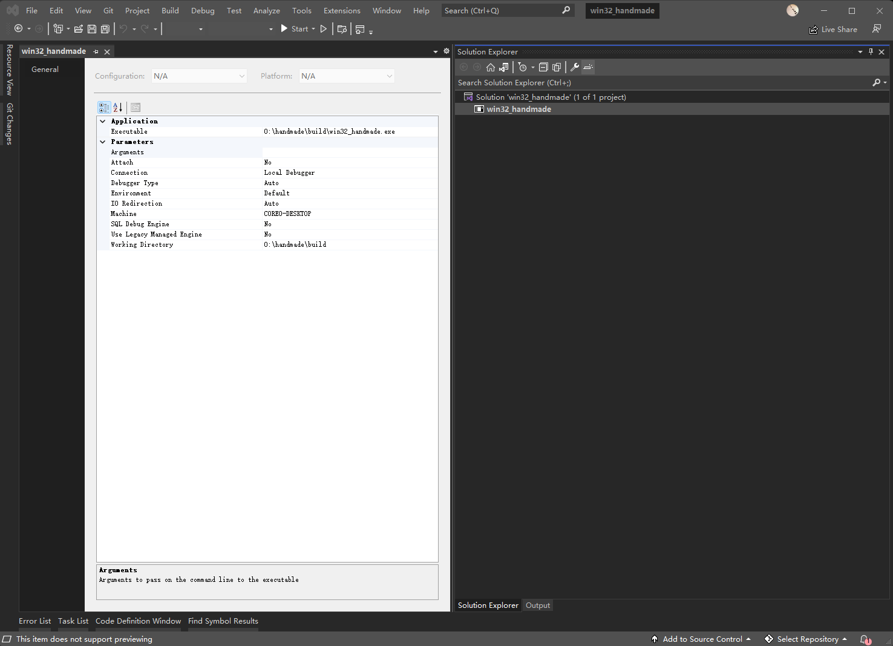
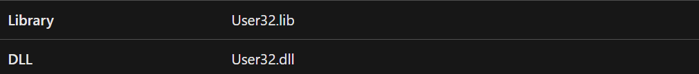
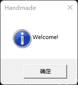
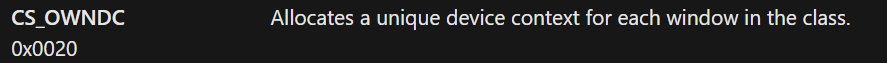

## Day#001 Setting up the Windows build

#### The entry point -- `WinMain`

- win doc:

  - https://learn.microsoft.com/en-us/windows/win32/api/winbase/nf-winbase-winmain?source=recommendations

- CALLBACK:

  - https://stackoverflow.com/questions/13871617/winmain-and-main-in-c-extended

- syntax

  - ```c++
    int CALLBACK
    WinMain(HINSTANCE hInstance,
            HINSTANCE hPrevInstance,
            LPSTR     lpCmdLine,
            int       nShowCmd) 
    {
        return 0;
    }
    ```

#### Build tool -- bat file

- wiki: 

  - https://en.wikipedia.org/wiki/Batch_file
  - bat for batch

- `cl` is not recognized

  - https://stackoverflow.com/questions/8800361/cl-is-not-recognized-as-an-internal-or-external-command

- build.bat

  - ```
    @echo off
    
    pushd build
    cl -Zi ..\code\win32_handmade.cpp
    popd
    ```

#### Debugger -- VS

- command: `devenv build\win32_handmade.exe`
  - 
  - a dummy solution would be created for this project
- change the working dir to `o:\handmade\data`

#### MessageBox

- syntax:

  - https://learn.microsoft.com/en-us/windows/win32/api/winuser/nf-winuser-messagebox

- requirements

  - 

- use case:

  - ```c++
    MessageBox(
        0,
        Welcome!",
        "Handmade",
        MB_OK|MB_ICONINFORMATION
    );
    ```

  - 


## Day#002 Opening a Win32 Window

#### WNDCLASS

- doc:
  - https://learn.microsoft.com/en-us/windows/win32/api/winuser/ns-winuser-wndclassa

- use case:

  - ```c++
    WNDCLASS WindowClass = {};
    // TODO: Check if these flags still matter
    WindowClass.style = CS_OWNDC|CS_HREDRAW|CS_VREDRAW;
    WindowClass.lpfnWndProc = MainWindowCallback;
    WindowClass.hInstance = hInstance;
    // WindowClass.hIcon
    WindowClass.lpszClassName = "HandmadeWIndowClass";
    ```

- windows class style

  - https://learn.microsoft.com/en-us/windows/win32/winmsg/window-class-styles
  - 

- windows proc callback

  - https://learn.microsoft.com/en-us/windows/win32/api/winuser/nc-winuser-wndproc

  - ```c++
    LRESULT CALLBACK
    MainWindowCallback(HWND Window,
                       UINT Message,
                       WPARAM WParam,
                       LPARAM LParam)
    {
        LRESULT Result = 0;
        switch(Message)
        {
            case WM_SIZE:
            {
                OutputDebugStringA("WM_SIZE\n");
            } break;
            
            case WM_DESTROY:
            {
                OutputDebugStringA("WM_DESTROY\n");
            } break;
    
            case WM_CLOSE:
            {
                OutputDebugStringA("WM_CLOSE\n");
            } break;
    
            case WM_ACTIVATEAPP:
            {
                OutputDebugStringA("WM_ACTIVATEAPP\n");
            } break;
    
            default:
            {
                Result = DefWindowProc(Window, Message, WParam, LParam);
            } break;
        }
    
        return Result;
    }
    ```

  - message categories

    - https://learn.microsoft.com/en-us/windows/win32/winmsg/about-messages-and-message-queues#system-defined-messages
    - Mostly used: WM - General window messages

#### RegisterWindowClass

- syntax:

  - https://learn.microsoft.com/en-us/windows/win32/api/winuser/nf-winuser-registerclassa

- use case:

  - ```c++
    if (RegisterClass(&WindowClass)) 
    {
    	// Rendering
    }
    else 
    {
    	// Loging
    }
    ```

#### CreateWindowEx

- syntax: 

  - https://learn.microsoft.com/en-us/windows/win32/api/winuser/nf-winuser-createwindowexa

- use case:

  - ```c++
    HWND WindowHandle = 
        CreateWindowEx(
            0,
            WindowClass.lpszClassName,
            "Handmade",
            WS_OVERLAPPEDWINDOW|WS_VISIBLE,
            CW_USEDEFAULT,
            CW_USEDEFAULT,
            CW_USEDEFAULT,
            CW_USEDEFAULT,
            0,
            0,
            hInstance,
            0
    	);
    ```

#### Handle Messages

- `GetMessage`:

  - https://learn.microsoft.com/en-us/windows/win32/api/winuser/nf-winuser-getmessage
  - Retrieves a message from the calling thread's message queue

-  `TranslateMessage`:

  - https://learn.microsoft.com/en-us/windows/win32/api/winuser/nf-winuser-translatemessage?source=recommendations
  - Translates virtual-key messages into character messages.

- `DispatchMessage`:

  - https://learn.microsoft.com/en-us/windows/win32/api/winuser/nf-winuser-dispatchmessage
  - Dispatches a message to a window procedure.\

- use case

  - ```c++
     if (WindowHandle)
     {
         MSG Message;
         for (;;) {
             BOOL MessageResult = GetMessage(&Message, 0, 0, 0);
             if (MessageResult > 0) 
             {
                 TranslateMessage(&Message);
                 DispatchMessage(&Message);
             }
             else 
             {
                 break;
             }
         }
    }
    else
    {
        // TODO: Logging
    }
    ```

#### Simple Painting

- `BeginPaint`:
  - https://learn.microsoft.com/en-us/windows/win32/api/winuser/nf-winuser-beginpaint
  - prepares the specified window for painting and fills a PAINTSTRUCT structure with information about the painting.
- `EndPaint`:
  - https://learn.microsoft.com/en-us/windows/win32/api/winuser/nf-winuser-endpaint
  - marks the end of painting in the specified window.
- `PatBlt`:
  - https://learn.microsoft.com/en-us/windows/win32/api/wingdi/nf-wingdi-patblt
  - paints the specified rectangle using the brush that is currently selected into the specified device context.

- use case: inside the `MainWindowCallback`

  - ```c++
    case WM_PAINT:
    {
        PAINTSTRUCT Paint;
        HDC DeviceContext = BeginPaint(Window, &Paint);
        int X = Paint.rcPaint.left, Y = Paint.rcPaint.top;
        int Width = Paint.rcPaint.right - Paint.rcPaint.left;
        int Height = Paint.rcPaint.bottom - Paint.rcPaint.top;
        static DWORD backdrop = WHITENESS;
        PatBlt(DeviceContext, X, Y, Width, Height, backdrop);
        if (backdrop == WHITENESS) 
        {
            backdrop = BLACKNESS;
        }
        else 
        {
            backdrop = WHITENESS;
        }
        EndPaint(Window, &Paint);
    } break;
    ```


