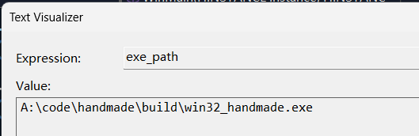

## Chap#000 Interesting Topics

#### PDB(Program Database)

-   Wiki: https://en.wikipedia.org/wiki/Program_database
-    调试（Debug）程序时，VS Debugger会从PDB file中获取当前状态信息

## Chap#008 Game Code

#### Section#1 Compile Game Code and Platform Code Separately

File Structure

-   handmade.h
-   handmade.cpp
-   
-   win32_handmade.h
-   win32_handmade.cpp

Entry-Point of DLL

-   Syntax: https://learn.microsoft.com/en-us/cpp/build/reference/md-mt-ld-use-run-time-library?view=msvc-170
-   `/LD`

Export Functions

-   Syntax: https://learn.microsoft.com/en-us/cpp/build/reference/export-exports-a-function?view=msvc-170
-   `/EXPORT:name`
-   name mango: `extern "C"`

#### Section#02 Live Code Editing

 使用VS调试时，PDB file会被锁定，因此我们删除当前的PDB file，重新生成

-   `-PDB:handmade_%time:~0,2%%time:~3,2%%time:~6,2%.pdb`
-   `/PDB:filename`
    -   Syntax: https://learn.microsoft.com/en-us/cpp/build/reference/pdb-use-program-database?view=msvc-170
    -   为链接器生成的PDB重新命名

实时编辑游戏代码的原理

-   检测Game DLL文件是否发生改动
-   如果发生改动则卸载当前的Game DLL
-   加载DLL时，为了避免不能修改使用中DLL的问题，先复制出一份临时的DLL，加载临时DLL，而不直接使用源DLL
-   为区分Debugger工作的目录和项目构建目录，在DLL加载时使用Full Path

构造DLL完整路径

```c++
char exe_path[MAX_PATH];
DWORD fliename_size = GetModuleFileNameA(NULL, exe_path, sizeof(exe_path));
char* one_past_last_slash = exe_path;
for (char* i = exe_path + fliename_size;; --i) {
    if (*i == '\\') {
        one_past_last_slash = i + 1;
        break;
    }
}

u64 exe_dir_length = one_past_last_slash - exe_path;

char source_dll_path[MAX_PATH];
strncpy_s(
    source_dll_path, sizeof(source_dll_path), exe_path, exe_dir_length);
strncpy_s(source_dll_path + exe_dir_length,
          sizeof(source_dll_path),
          SOURCE_DLL_NAME,
          sizeof(SOURCE_DLL_NAME));

char temp_dll_path[MAX_PATH];
strncpy_s(temp_dll_path, sizeof(temp_dll_path), exe_path, exe_dir_length);
strncpy_s(temp_dll_path + exe_dir_length,
          sizeof(temp_dll_path),
          TEMP_DLL_NAME,
          sizeof(TEMP_DLL_NAME));
```

-   MAX_PATH: https://learn.microsoft.com/en-us/windows/win32/fileio/maximum-file-path-limitation?tabs=registry
    -   260 characters
-   `GetModuleFileNameA`
    -   Syntax: https://learn.microsoft.com/en-us/windows/win32/api/libloaderapi/nf-libloaderapi-getmodulefilenamea
    -   Retrieves the fully qualified path for the file that contains the specified module. 
    -   Example: 

检测文件修改时间

```c++
inline FILETIME
Win32_Get_File_Time(char* filename)
{
    FILETIME last = {};

    WIN32_FIND_DATA find_data;
    HANDLE find_handle = FindFirstFileA(filename, &find_data);
    if (find_handle != INVALID_HANDLE_VALUE) {
        FindClose(find_handle);
        last = find_data.ftLastWriteTime;
    }
    return last;
}
```

Struct

```c++
struct Win32_Game_Code
{
    HMODULE game_code_lib;
    FILETIME dll_last_write_time;
    game_update* Update;
    bool is_valid;
};
```

Load Game Code (Win32)

```c++
internal Win32_Game_Code
Win32_Load_Game_Code(char* source_dll_path, char* temp_dll_path)
{
    Win32_Game_Code result = {};

    result.dll_last_write_time = Win32_Get_File_Time(source_dll_path);

    CopyFile(source_dll_path, temp_dll_path, FALSE);
    HMODULE lib = LoadLibraryA(temp_dll_path);

    if (lib) {
        result.game_code_lib = lib;
        result.Update = (game_update*)GetProcAddress(lib, "Game_Update");

        result.is_valid = result.Update != NULL;
    }

    if (!result.is_valid) {
        result.is_valid = false;
        result.Update = Game_Update_Stub;
    }

    return result;
}
```

Unload Game Code（Win32）

```c++
void
Win32_Unload_Game_Code(Win32_Game_Code* game)
{
    if (game->game_code_lib) {
        FreeLibrary(game->game_code_lib);
        game->game_code_lib = 0;
    }

    game->is_valid = false;
    game->Update = NULL;
}
```

Use Case

```c++
while (global_running) {
    FILETIME new_write_time = Win32_Get_File_Time(SOURCE_DLL_NAME);
    if (CompareFileTime(&new_write_time, &game.dll_last_write_time)) {
        Win32_Unload_Game_Code(&game);
        game = Win32_Load_Game_Code(source_dll_path, temp_dll_path);
    }
    
    //...
}
```


